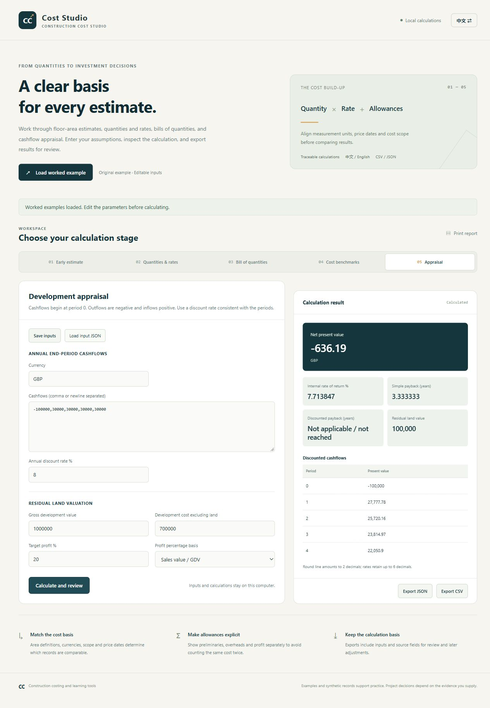
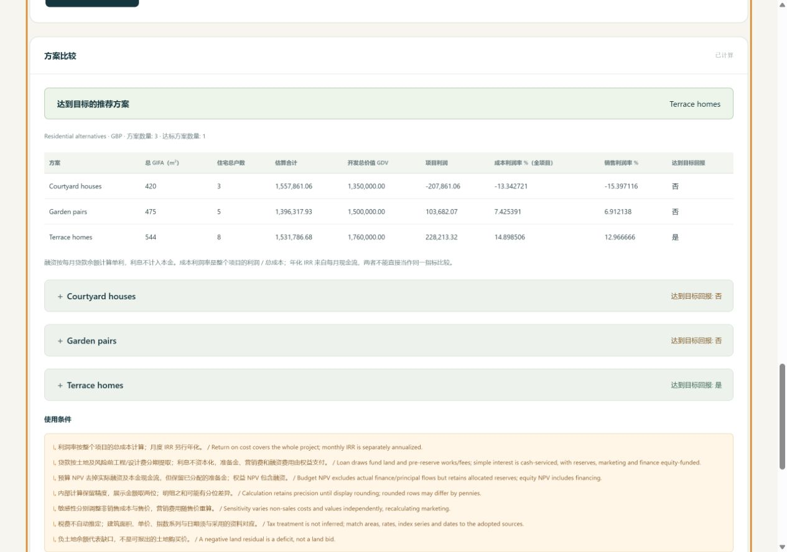

# Construction Cost Analyzer

[简体中文](README_zh.md) · [Methods](docs/course-methods.md) · [Data sources](docs/data-sources.md) · [MIT License](LICENSE)

A local quantity surveying toolkit for measured work, resource-based unit rates, bills of quantities, indexed cost estimates and development appraisal. Built around the methods in **Construction Quantification and Costing**.

The Chinese–English browser workspace and Python CLI share one calculation engine. Inputs, price references, dates and calculation bases accompany exported results, so an estimate can be checked and revised in a spreadsheet.



## Start the workspace

Requires **Python 3.10 or later**. The application, CLI and core tests use the standard library; no package installation is needed.

```bash
python -m cost_analyzer serve
```

Open **http://127.0.0.1:8765/**. On Windows, double-click `start.cmd`. Select **Load example**, edit the inputs and calculate. Switch between 中文 and English in the page header. The server listens on the local loopback interface; files are processed on your computer.

## Estimating workflow

| Stage | Calculation and output |
| --- | --- |
| Early estimate | Floor area × base rate, with explicit price, location and specification adjustments. Separately show preliminaries, overheads and profit, contingency, fees and VAT. |
| Quantity takeoff | Area, volume, length, counts and rectangular centreline measurement. Continuous strip foundations show excavation, concrete and natural backfill separately. |
| Unit-rate build-up | Material pack conversions and waste, whole-crew productivity, plant output, subcontract costs and markup. Transfer the priced rate to a BOQ item. |
| Bill of quantities | Import CSV or add items in the browser. Calculate rounded line amounts, element totals and project allowances. Included-cost flags prevent adding preliminaries or OH&P twice. |
| Comparable projects | Filter by function, region, currency, cost scope and evidence type; normalize compatible price/location indices and compare median, quartiles and budget deviations. |
| Development appraisal | Annual end-of-period cashflows, NPV, conventional IRR, simple and discounted payback, and residual land value with profit on GDV or total cost. |
| Residential options | Housing mixes, a detailed OCE, staged monthly borrowing, profit on cost, annualized IRR, finance-aware residual land value and nine cost/value sensitivities per option. |

Save and reload input JSON; export results to JSON and CSV or print the browser report. CLI reports also include a standalone HTML file. Changing inputs marks the previous result as stale and disables its export until recalculated.

## Data you can work with

- **1,500 official ONS index observations:** ten construction OPI series over 150 months, January 2014–June 2026, frozen from the 13 August 2026 release. The estimate form can select historical base and target months. The CSV has attribution, release metadata and checksums.
- **500 reproducible project scenarios:** five building functions and four illustrative location levels, generated with seed 42. These are labeled `synthetic`; their prices, dates and index assumptions are not calibrated market evidence.
- **Your own project history:** import sourced `observed` records using [the CSV template](examples/project-history-template.csv). Keep currency, cost scope, index series and base year consistent. The original 18 illustrative records remain available separately through the legacy analysis script.

ONS OPI measures construction output prices; it is distinct from BCIS Tender Price Index and does not provide supplier rates, location factors or future forecasts. The 1,500 observations are index records, not completed projects. See [data sources and licensing](docs/data-sources.md).

## Check the worked examples

All rates in [examples](examples/) are self-authored arithmetic inputs. Replace them with project quotations and measured quantities before estimating actual work.

| Example | Checkable result |
| --- | --- |
| 1,000 m² at £1,000/m²; price factor 1.20; location factor 1.05; preliminaries 10%; OH&P 5% | £1,455,300 total |
| 10 m × 8 m external rectangle; 0.30 m walls; 0.80 m × 1.20 m trench; 0.60 m × 0.30 m concrete | 34.8 m centreline; 33.408 m³ excavation; 6.264 m³ concrete; 27.144 m³ backfill |
| Brick and mortar £33.12/m²; crew £48/h producing 2 m²/h; markup 10% | £57.12/m² direct rate; £62.832/m² quoted rate |

```bash
python -m cost_analyzer demo --output outputs/demo
python -m cost_analyzer estimate examples/early-estimate.json --output outputs/estimate
python -m cost_analyzer boq --input examples/boq.csv --project examples/project.json --output outputs/boq
python -m cost_analyzer benchmark --input data/synthetic_projects.csv --building-type office --currency GBP --source-type synthetic --output outputs/benchmark
python -m cost_analyzer appraise examples/appraisal.json --output outputs/appraisal
python -m cost_analyzer development examples/development.json --output outputs/development
```

Each report directory contains JSON, UTF-8 CSV and HTML. Run `python -m cost_analyzer --help` or append `--help` to a command for available flags.

For early-cost-advice coursework, select **Development options**, enter each housing mix and the required allowance bases, and compare the OCE, monthly finance and sensitivity tables. An option is recommended only when it meets the entered return-on-cost hurdle. [The development workflow](docs/development-workflow.md) explains embedded preliminaries, alternative reserve scopes and the distinction between completion indices and future inflation allowances. This module retains Decimal precision until display rounding.



## Measurement and pricing basis

The toolkit follows course topics in design economics, early estimating, centreline measurement, labour/material/plant pricing and development appraisal. [The method notes](docs/course-methods.md) state formulas, allowance bases, rounding and exclusions.

Net quantities and material waste are calculated separately. Rectangular strip geometry requires additional items for junctions, working space, support, bulking and disposal where applicable. Allowance percentages and VAT are user inputs; the software does not determine tax treatment or project-specific contractual measurement rules.

Amounts use decimal arithmetic and round half up to two decimal places. BOQ quantities and rates support up to six decimal places; line totals are rounded before summation. Supplied mixed currencies, cost scopes, evidence types or index bases must be filtered or corrected before benchmarking. Nonconventional cashflows retain NPV but do not receive a potentially ambiguous IRR.

## Development and verification

```bash
python -X utf8 -m unittest discover -s tests -v
python -X utf8 scripts/generate_examples.py
```

Tests cover worked calculations, rounding and numerical limits, duplicate allowances, malformed CSV/JSON, index comparability, report escaping, CLI commands and the actual local HTTP API. Node.js enables browser utility checks. Optional XLSX importer fixtures require an existing `openpyxl` environment; normal use reads the frozen CSV. CI runs the core suite on Windows and Linux with Python 3.10–3.13.

[analysis.ipynb](analysis.ipynb) provides a reproducible walkthrough. For optional charts, use the tested versions in [requirements.txt](requirements.txt) and run:

```bash
python analysis/chart_generator.py
```

| Path | Purpose |
| --- | --- |
| [cost_analyzer](cost_analyzer/) | Engine, CLI, local server and bilingual interface |
| [examples](examples/) | Worked inputs, BOQ CSV and project-history template |
| [data/indices](data/indices/) | ONS snapshot, source metadata and checksums |
| [scripts/import_ons_opi.py](scripts/import_ons_opi.py) | Hash-checked import of the reviewed ONS release |
| [tests](tests/) | Calculation, data and interface regression checks |
| [analysis/analyzer.py](analysis/analyzer.py) | Separate compatibility report for the original 18 records |

Software and original examples are MIT licensed. The ONS index data is attributed under the [Open Government Licence v3.0](https://www.nationalarchives.gov.uk/doc/open-government-licence/version/3/). CI references and optional package versions are recorded in [the toolchain notes](docs/toolchain.md).
